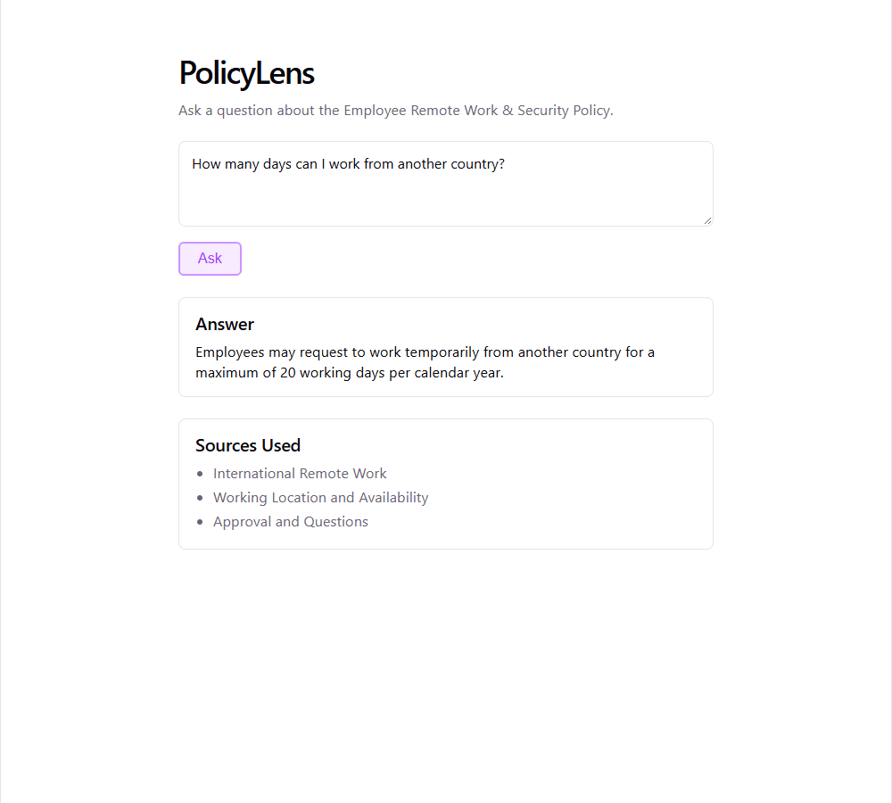

# PolicyLens RAG Assistant

A small full-stack RAG (Retrieval-Augmented Generation) app: employees ask questions about a
company policy in plain English, and get back an answer grounded strictly in the policy document —
never invented — along with the policy sections it was drawn from.

Built with **.NET 10** (ASP.NET Core Web API), **React 19** (Vite + TypeScript), and **OpenAI**
(`text-embedding-3-small` for embeddings, `gpt-4o-mini` for answers), using
**Microsoft.Extensions.AI** for the embedding/chat abstractions and the **Microsoft Agent
Framework** (`Microsoft.Agents.AI`) for the grounded-answer step.



See [`docs/architecture.md`](docs/architecture.md) for a diagram and a deeper explanation of the
pipeline.

## Example

```
POST /api/ask
{ "question": "How many days can I work from another country?" }

200 OK
{
  "answer": "Employees may request to work temporarily from another country for a maximum of 20 working days per calendar year.",
  "sources": ["International Remote Work", "Working Location and Availability", "Approval and Questions"]
}
```

Questions the policy doesn't cover (e.g. "What company car can I buy?") get an explicit
"the policy does not contain this information" answer instead of an invented one.

## Project structure

```
RAG-React-App/
├── PolicyLens.slnx
├── PolicyLens.Api/              # ASP.NET Core Web API (.NET 10)
├── policylens-web/              # React + Vite + TypeScript frontend
├── docs/                        # architecture.md, screenshot.png
├── PolicyLens_Sample_Employee_Remote_Work_Security_Policy.pdf   (local only, gitignored)
└── RAG_Practical_Task_DotNet_React_FIXED.pdf                     (local only, gitignored)
```

> The two source PDFs are kept local (see `.gitignore`) rather than committed to the repo.

## Setup

### Prerequisites

- .NET 10 SDK
- Node.js 22+ / npm
- An OpenAI API key

### 1. API

```bash
cd PolicyLens.Api
dotnet user-secrets set "OpenAI:ApiKey" "sk-..."
dotnet run
```

Runs on `http://localhost:5143` by default (see `Properties/launchSettings.json`). On first run it
extracts the policy PDF, generates embeddings for its 12 sections, and stores them in a local
`policylens.db` SQLite file (gitignored); subsequent runs skip re-ingestion.

### 2. Frontend

```bash
cd policylens-web
npm install
npm run dev
```

Runs on `http://localhost:5173`, proxying `/api/*` requests to the API at `http://localhost:5143`
(see `vite.config.ts`).

Open `http://localhost:5173` and ask a question.

## How it works

- **Ingestion** — `PdfIngestionService` extracts the policy PDF's text with
  [PdfPig](https://github.com/UglyToad/PdfPig) and splits it into one chunk per numbered section
  (e.g. `"3. International Remote Work"`), keeping each section's heading and body together.
- **Embeddings** — each chunk (and later, each incoming question) is embedded with OpenAI's
  `text-embedding-3-small` via `Microsoft.Extensions.AI`'s `IEmbeddingGenerator` abstraction.
- **Vector search** — chunks are stored in SQLite via a `VectorStoreCollection<string, PolicyChunk>`
  (the `Microsoft.Extensions.VectorData` abstraction). At query time, the question's embedding is
  compared against every stored chunk by cosine similarity, and the top 3 matches are returned.
  (See [`docs/architecture.md`](docs/architecture.md) for why this is a small hand-rolled connector
  rather than the official SQLite package.)
- **Grounding** — the top-3 chunks and the question are handed to a Microsoft Agent Framework
  `AIAgent` (`PolicyAnsweringAgent`), wrapping an OpenAI chat client (`gpt-4o-mini`), with explicit
  instructions to answer only from the supplied excerpts and to say so plainly when they don't
  cover the question.
- **API** — `POST /api/ask` ties it together: retrieve → ground → respond with
  `{ answer, sources }`.

## Testing

`PolicyLens.Api/PolicyLens.Api.http` has ready-to-run requests for the 5 sample questions
(including the "not in policy" case). All 5 have been verified end-to-end, including through the
actual React UI.
