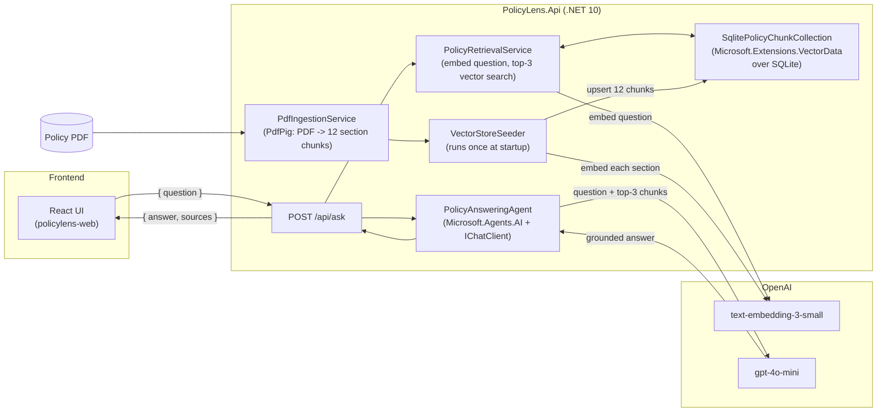

# Architecture

PolicyLens is a small RAG (Retrieval-Augmented Generation) pipeline: a React frontend sends a
question to an ASP.NET Core API, which retrieves the most relevant policy excerpts via vector
similarity search and asks an LLM agent to answer strictly from those excerpts.

## Flow

1. **Ingestion (once, at API startup)** — `VectorStoreSeeder` checks whether the vector store
   already has data (looks up section `"1"`). If empty, `PdfIngestionService` extracts the policy
   PDF's text with PdfPig and splits it into one chunk per numbered section (12 sections). Each
   chunk's text is embedded via OpenAI's `text-embedding-3-small` and upserted into SQLite.
2. **Retrieval** — on `POST /api/ask`, `PolicyRetrievalService` embeds the incoming question with
   the same embedding model, then ranks all stored chunks by cosine similarity and returns the
   top 3.
3. **Grounding** — `PolicyAnsweringAgent` wraps an OpenAI chat client (`gpt-4o-mini`) in a
   Microsoft Agent Framework `AIAgent`, instructed to answer only from the supplied excerpts and
   to say so explicitly when they don't cover the question. It receives the question plus the
   3 retrieved excerpts as its prompt.
4. **Response** — the API returns `{ answer, sources }`, where `sources` are the section titles of
   the retrieved chunks. The React UI renders the answer and a "Sources Used" list.

## Why a hand-rolled SQLite vector collection

The official `Microsoft.SemanticKernel.Connectors.SqliteVec` connector (latest: 1.74.0-preview) is
compiled against `Microsoft.Extensions.VectorData.Abstractions` 10.1.0 and throws at runtime under
anything newer, while `Microsoft.Agents.AI` (the Agent Framework) requires `Abstractions` >= 10.10.0.
No version of either package satisfies both as of this project's implementation. `Services/SqlitePolicyChunkCollection.cs`
implements `VectorStoreCollection<string, PolicyChunk>` directly against `Microsoft.Data.Sqlite`,
storing embeddings as float32 blobs and doing brute-force cosine similarity in memory — trivial at
this scale (12 chunks). This keeps the `Microsoft.Extensions.VectorData` abstraction and SQLite
storage while staying on the latest Agent Framework release.
